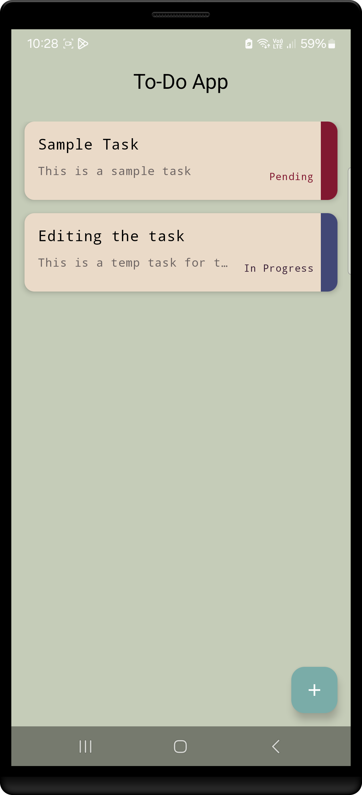
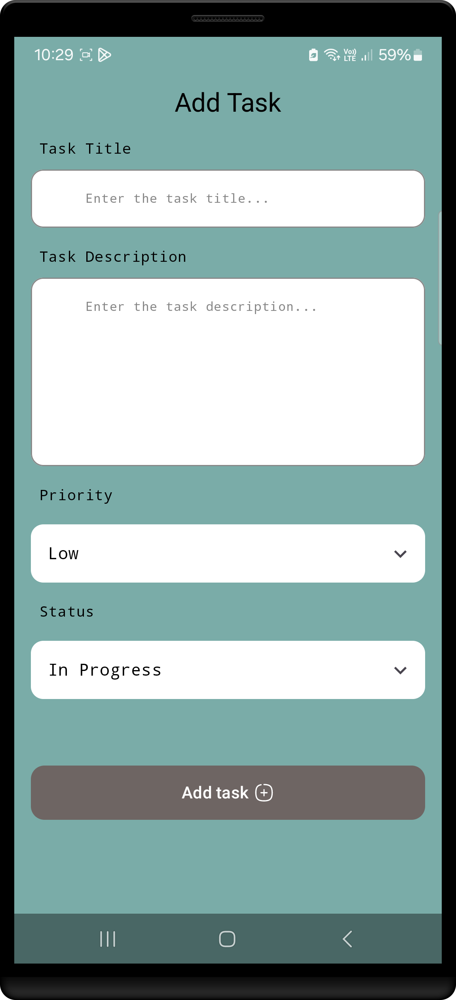
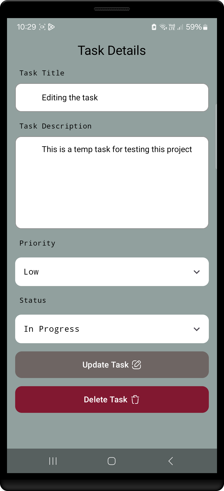

# Task Manager App

A productivity-focused mobile application built for Android that allows users to easily manage and organize their tasks. With features like task creation, updates, deletion, and synchronization with cloud storage, the Task Manager App helps users stay on top of their to-dos. This app was built as part of the **PRODIGY Android Development Internship** second task, demonstrating the use of modern Android development practices such as Clean Architecture, Room Database, Jetpack Compose, and Dependency Injection with Hilt.

## Features

- **Task Management**: Create, update, delete, and view tasks.
- **Offline Support**: Persist tasks locally using Room Database for offline functionality.
- **Supabase Integration**: Sync tasks with the cloud using Supabase, enabling cross-device data sync.
- **ViewModel & StateFlow**: Utilize ViewModel and StateFlow to manage UI state and data flows for a responsive UI.
- **Dependency Injection**: Leverage Hilt for dependency injection, simplifying the code structure and improving testability.

## PRODIGY Android Development Internship

This project is part of the **PRODIGY Android Development Internship** and was developed as the **second task** of the internship program. The task involved building a fully functional Android application to showcase proficiency in:

- **Room Database**: Implementing local data persistence using Room for offline capabilities.
- **Clean Architecture**: Structuring the project with Clean Architecture principles for scalability and maintainability.
- **Jetpack Compose**: Building modern UIs with Jetpack Compose, following best practices for a reactive UI design.
- **Dependency Injection with Hilt**: Using Hilt for efficient dependency management and ensuring a modular, testable codebase.

Through this task, I have enhanced my skills in using **Room** and **Hilt**, as well as designing maintainable applications that are easy to extend and test. This project is a step forward in my journey to becoming proficient in Android development.

## Tech Stack

- **Android**: Kotlin, Jetpack Compose
- **Database**: Room Database for local storage
- **Dependency Injection**: Hilt
- **Architecture**: Clean Architecture with separation of concerns (Repositories, Use Cases, ViewModel)
- **UI**: Jetpack Compose with a reactive UI powered by StateFlow

## Screenshots for the application
<div style="display: flex; justify-content: space-around; align-items: center;">

  <div style="text-align: center; margin: 10px;">
    <h4>Home screen</h4>
    
  </div>

  <div style="text-align: center; margin: 10px;">
    <h4>Add new task</h4>
    
  </div>

  <div style="text-align: center; margin: 10px;">
    <h4>Task details</h4>
    
  </div>

</div>

## Setup

Follow these steps to run the project locally:

### 1. Clone the Repository

Clone this repository to your local machine:

```bash
git clone https://github.com/yourusername/task-manager-app.git
```

### 2. Open the Project in Android Studio

Open Android Studio and select **Open an Existing Project**, then navigate to the project directory and open it.

### 3. Add Dependencies

Ensure that all the required dependencies are added in the `build.gradle` files. The project uses the following key dependencies:
- `Room Database`
- `Hilt for Dependency Injection`
- `Jetpack Compose`

You can sync the project dependencies by clicking **Sync Now** in Android Studio after opening the project.

### 4. Build and Run the Project

1. Ensure your Android emulator or device is running.
2. In Android Studio, click **Run** (the green arrow) to build and launch the app.

## Project Structure

The project follows a clean architecture approach with well-defined layers and modular structure.

```
app
|-- common                             // Shared resources and utilities used across the app
|    |-- icons                         // Reusable icon assets
|    |-- resources                    // Resource management (e.g., strings, colors, themes)
|
|-- di                                  // Dependency Injection modules
|    |-- data_source                   // Data source modules (API, DB, etc.)
|    |    |-- RoomModule.kt            // Provides Room DB and DAO services
|
|-- data                                // Data sources and repositories
|    |-- data_source                   // Data sources (API, DB)
|    |    |-- db                        // Room database services
|    |    |    |-- TaskDao.kt          // Task DAO interface
|    |    |    |-- TaskDatabase.kt     // Room database setup
|    |    |    |-- TaskEntity.kt       // Room database table entity
|
|-- domain                              // Business logic and core functionality
|    |-- repository                     // Repository implementations
|    |    |-- TaskRepositoryImpl.kt     // Task repository implementation
|
|-- presentation                        // UI components and navigation
|    |-- components                     // Reusable composable components used in screens
|    |
|    |-- screens                        // Screen-specific composables (UI)
|    |    |-- AddTaskScreen.kt           // UI for adding a new task
|    |    |-- TaskDetailsScreen.kt      // UI for viewing and updating task details
|    |    |-- TasksScreen.kt            // UI for viewing and managing all tasks
|    |
|    |-- viewmodel                      // ViewModel classes for screen logic
|    |    |-- TaskViewModel.kt          // ViewModel for managing tasks
|    |
|    |-- navigation                     // Navigation setup and endpoints
|    |    |-- AppNavigation.kt          // Contains the navigation graph for the app
|    |    |-- ScreensEndpoint.kt        // Contains all the screen endpoints (routes) for the app

```

### Key Components

- **RoomModule.kt**: Provides Room Database dependencies (AppDatabase and TaskDao).
- **TaskRepositoryModule.kt**: Provides dependencies for Task repository.
- **TaskUseCaseModule.kt**: Provides dependencies for Task use cases.
- **TaskRepository**: Handles data operations from Room and Supabase.
- **TaskUseCases**: Defines business logic for tasks (add, delete, get).
- **TaskViewModel**: Manages UI state and interacts with Task use cases.

## Contributing

Contributions are welcome! If you have suggestions, bug fixes, or new features to add, feel free to fork the repository, create a new branch, and submit a pull request.

1. Fork the repository.
2. Create a new branch (`git checkout -b feature/new-feature`).
3. Commit your changes (`git commit -am 'Add new feature'`).
4. Push to the branch (`git push origin feature/new-feature`).
5. Create a new pull request.

## License

This project is licensed under the MIT License - see the [LICENSE](LICENSE) file for details.
